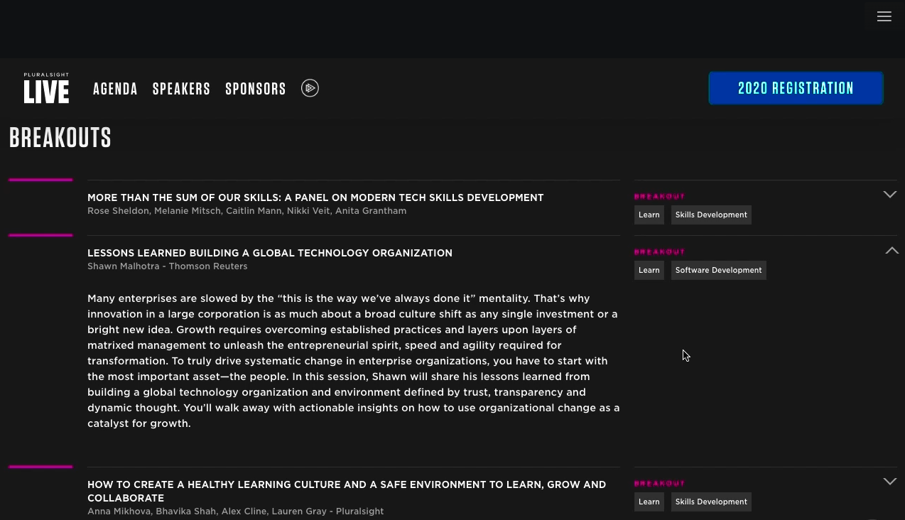
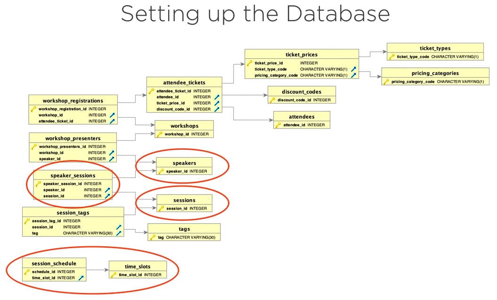

# Complete Spring Framework: Creating Your First Spring Boot Application

<!-- TOC -->

- [Complete Spring Framework: Creating Your First Spring Boot Application](#complete-spring-framework-creating-your-first-spring-boot-application)
- [Bootstrap using UI](#bootstrap-using-ui)
- [Bootstrap using CLI](#bootstrap-using-cli)
- [Docker Database](#docker-database)
- [Postgres Client](#postgres-client)
- [What We Are Building](#what-we-are-building)
    - [Frontend](#frontend)
    - [Database Schema](#database-schema)
- [Create Database](#create-database)
- [Conference-Demo](#conference-demo)
    - [Demo 01. Connecting to the Database](#demo-01-connecting-to-the-database)
    - [Demo 02. Creating JPA Models](#demo-02-creating-jpa-models)
    - [Demo 03. Working with JPA Relationships](#demo-03-working-with-jpa-relationships)
    - [Demo 04. Working with Binary Data Types](#demo-04-working-with-binary-data-types)
    - [Demo 05. Creating JPA Repositories](#demo-05-creating-jpa-repositories)
    - [Demo 06. Creating Spring API REST Controllers - Part 1](#demo-06-creating-spring-api-rest-controllers---part-1)
    - [Demo 07. Creating Spring API REST Controllers - Part 2](#demo-07-creating-spring-api-rest-controllers---part-2)
    - [Demo 08. Handling Serialization Issues and Running the App](#demo-08-handling-serialization-issues-and-running-the-app)
    - [Demo 09. Adding a Custom Application Property](#demo-09-adding-a-custom-application-property)
- [Spring Boot Config](#spring-boot-config)
    - [Order of Precedence](#order-of-precedence)
    - [How to configure secrets in Application Properties](#how-to-configure-secrets-in-application-properties)
    - [How to handle different environments](#how-to-handle-different-environments)
- [Deployment](#deployment)
    - [Create Executable JAR Deployments](#create-executable-jar-deployments)
    - [Create Standalone Executable JAR Files](#create-standalone-executable-jar-files)

<!-- /TOC -->

# Bootstrap using UI

Navigate to [Spring Initializr](https://start.spring.io), and enter the following parameters.
- Project: **Maven Project**
- Language: **Java**
- Spring Boot: **2.6.2**
- Project Metadata:
  - Group: **com.pluralsight**
  - Artifact: **conference-demo**
  - Name: **conference-demo**
  - Description: **Demo project for Spring Boot**
  - Package name: **com.pluralsight.conference-demo**
  - Packaging: **Jar**
  - Java: **8**
- Dependencies: **Spring Web**

Click **Generate** to bootstrap your new application and download a ZIP file to your workstation. Create a new project folder `springcode` and unzip the ZIP file in your project folder.

---
# Bootstrap using CLI

Alternatively, you could use the **Spring Boot CLI** to bootstrap your application.

If you are on a Mac and using **Homebrew**, all you need to do to install the Spring Boot CLI is:

```sh
brew tap spring-io/tap
brew install spring-boot
```

Verify that Spring CLI has been installed:

```sh
spring --version
Spring CLI v2.6.2
```

# Docker Database

Navigate to the [GitHub repository](https://github.com/dlbunker/ps-first-spring-boot-app) for Pluralsight First Spring Boot App. Navigate to the `database/postgresql` folder which contains the README file for setting up the database.

The setup is duplicated here for convenience.

1. Create a Docker container with **Postgres** database:

```sh
docker create --name objPostgres -e POSTGRES_PASSWORD=password -p 5432:5432 postgres:11.5-alpine
```

2. Start container.

```sh
docker start objPostgres
```

3. Stop container.

```sh
docker stop objPostgres
```

4. Connection info.

* JDBC URL: `jdbc:postgresql://localhost:5432/conference_app`

* Username: `postgres`

* Password: `password`

> This stores the data inside the container - when you delete the container, the data is deleted as well.

# Postgres Client

* [Postico](https://eggerapps.at/postico)
* [Postbird](https://github.com/Paxa/postbird)

# What We Are Building

## Frontend



## Database Schema



# Create Database

1. Connect to PSQL prompt from Docker container, and create the database.

```db
docker exec -it objPostgres psql -U postgres
create database conference_app;
exit
```

2. Create the tables.

```sh
docker cp create_tables.sql objPostgres:/create_tables.sql
docker exec -it objPostgres psql -d conference_app -f create_tables.sql -U postgres
```

3. Install the data.

```sh
docker cp insert_data.sql objPostgres:/insert_data.sql
docker exec -it objPostgres psql -d conference_app -f insert_data.sql -U postgres
```

# Conference-Demo

Now that you've bootstrap the Spring Boot application and setup the Postgres SQL database, it's time to create your conference demo application.

## [Demo 01. Connecting to the Database](./demo01.md#connecting-to-the-database)

## [Demo 02. Creating JPA Models](./demo02.md#creating-jpa-models)

## [Demo 03. Working with JPA Relationships](./demo03.md#working-with-jpa-relationships)

## [Demo 04. Working with Binary Data Types](./demo04.md#working-with-binary-data-types)

## [Demo 05. Creating JPA Repositories](./demo05.md#creating-jpa-repositories)

## [Demo 06. Creating Spring API REST Controllers - Part 1](./demo06.md#creating-spring-api-rest-controllers---part-1)

## [Demo 07. Creating Spring API REST Controllers - Part 2](./demo07.md#creating-spring-api-rest-controllers---part-2)

## [Demo 08. Handling Serialization Issues and Running the App](./demo08.md#handling-serialization-issues-and-running-the-app)

## [Demo 09. Adding a Custom Application Property](./demo09.md#adding-a-custom-application-property)

# Spring Boot Config

## Order of Precedence

**External sources**
1. Command line arguments
2. SPRING_APPLICATION_JSON arguments
3. Servlet parameters
4. JNDI
5. Java System Properties
6. OS environment variables

**Internal sources**
7. Profile properties
8. Application properties
9. `@PropertySource` annotations
10. Default properties

In our demo, we will be using both OS environment variables and application properties for our external and internal sources respectively. The default application properties are found at [Spring Boot Common Application Properties](https://docs.spring.io/spring-boot/docs/current/reference/html/application-properties.html).

## How to configure secrets in Application Properties

Open the `application.properties` file in path `src/main/resources/` and edit the following lines:

```properties
spring.datasource.url=${DB_URL}
spring.datasource.username=${DB_USERNAME}
spring.datasource.password=${DB_PASSWORD}
...
```

```sh
export DB_URL=jdbc:postgresql://localhost:5432/conference_app
export DB_USERNAME=postgres
export DB_PASSWORD=password
```

## How to handle different environments

Spring Boot uses a combination of profiles and profile-specific application properties files to handle different environments, e.g. application-PROFILE.properties. To specify the PROFILE, you have to use the parameter `-Dspring.profiles.active=PROFILE` on your Java VM.

> Note: Spring Boot can use both `application.yml` and `application.properties` to configure its variables. Also, the profile-specific environments can be used with both types of application files.

# Deployment

Spring Boot application can run as a standalone as the framework comes with an embedded server. The default embedded server is **Tomcat**, however it also has **Jetty** and **Undertow** embedded servers.

## Create Executable JAR Deployments

1. Create a JAR file with **Maven**. Click on the **Maven** button within IntelliJ IDE, then click on **Execute Maven Goal** icon. Run `mvn package`.

If successful, **Maven** creates a `conference-demo-0.0.1.SNAPSHOT.jar` file in the path `target/`. Open a local terminal and run the following command:

```sh
java -jar target/conference-demo-0.0.1.SNAPSHOT.jar

  .   ____          _            __ _ _
 /\\ / ___'_ __ _ _(_)_ __  __ _ \ \ \ \
( ( )\___ | '_ | '_| | '_ \/ _` | \ \ \ \
 \\/  ___)| |_)| | | | | || (_| |  ) ) ) )
  '  |____| .__|_| |_|_| |_\__, | / / / /
 =========|_|==============|___/=/_/_/_/
 :: Spring Boot ::                (v2.6.2)

2022-01-17 14:00:03.367  INFO 4101 --- [           main] c.p.c.ConferenceDemoApplication          : Starting ConferenceDemoApplication v0.0.1-SNAPSHOT using Java 1.8.0_312 on dbmacm3 with PID 4101 (/Users/dennislwm/fx-git-pull/13springcode/src/Bunker2019/conference-demo/target/conference-demo-0.0.1-SNAPSHOT.jar started by dennislwm in /Users/dennislwm/fx-git-pull/13springcode/src/Bunker2019/conference-demo/target)
2022-01-17 14:00:03.372  INFO 4101 --- [           main] c.p.c.ConferenceDemoApplication          : No active profile set, falling back to default profiles: default
2022-01-17 14:00:04.895  INFO 4101 --- [           main] .s.d.r.c.RepositoryConfigurationDelegate : Bootstrapping Spring Data JPA repositories in DEFAULT mode.
2022-01-17 14:00:05.041  INFO 4101 --- [           main] .s.d.r.c.RepositoryConfigurationDelegate : Finished Spring Data repository scanning in 123 ms. Found 2 JPA repository interfaces.
2022-01-17 14:00:06.598  INFO 4101 --- [           main] o.s.b.w.embedded.tomcat.TomcatWebServer  : Tomcat initialized with port(s): 8080 (http)
2022-01-17 14:00:06.611  INFO 4101 --- [           main] o.apache.catalina.core.StandardService   : Starting service [Tomcat]
2022-01-17 14:00:06.611  INFO 4101 --- [           main] org.apache.catalina.core.StandardEngine  : Starting Servlet engine: [Apache Tomcat/9.0.56]
2022-01-17 14:00:06.682  INFO 4101 --- [           main] o.a.c.c.C.[Tomcat].[localhost].[/]       : Initializing Spring embedded WebApplicationContext
2022-01-17 14:00:06.682  INFO 4101 --- [           main] w.s.c.ServletWebServerApplicationContext : Root WebApplicationContext: initialization completed in 3073 ms
2022-01-17 14:00:07.486  INFO 4101 --- [           main] o.hibernate.jpa.internal.util.LogHelper  : HHH000204: Processing PersistenceUnitInfo [name: default]
2022-01-17 14:00:07.606  INFO 4101 --- [           main] org.hibernate.Version                    : HHH000412: Hibernate ORM core version 5.6.3.Final
2022-01-17 14:00:08.060  INFO 4101 --- [           main] o.hibernate.annotations.common.Version   : HCANN000001: Hibernate Commons Annotations {5.1.2.Final}
2022-01-17 14:00:08.295  INFO 4101 --- [           main] com.zaxxer.hikari.HikariDataSource       : HikariPool-1 - Starting...
2022-01-17 14:00:08.485  INFO 4101 --- [           main] com.zaxxer.hikari.HikariDataSource       : HikariPool-1 - Start completed.
2022-01-17 14:00:08.522  INFO 4101 --- [           main] org.hibernate.dialect.Dialect            : HHH000400: Using dialect: org.hibernate.dialect.PostgreSQLDialect
2022-01-17 14:00:09.810  INFO 4101 --- [           main] o.h.e.t.j.p.i.JtaPlatformInitiator       : HHH000490: Using JtaPlatform implementation: [org.hibernate.engine.transaction.jta.platform.internal.NoJtaPlatform]
2022-01-17 14:00:09.840  INFO 4101 --- [           main] j.LocalContainerEntityManagerFactoryBean : Initialized JPA EntityManagerFactory for persistence unit 'default'
2022-01-17 14:00:10.825  WARN 4101 --- [           main] JpaBaseConfiguration$JpaWebConfiguration : spring.jpa.open-in-view is enabled by default. Therefore, database queries may be performed during view rendering. Explicitly configure spring.jpa.open-in-view to disable this warning
2022-01-17 14:00:11.775  INFO 4101 --- [           main] o.s.b.w.embedded.tomcat.TomcatWebServer  : Tomcat started on port(s): 8080 (http) with context path ''
2022-01-17 14:00:11.807  INFO 4101 --- [           main] c.p.c.ConferenceDemoApplication          : Started ConferenceDemoApplication in 9.298 seconds (JVM running for 10.084)
```

## Create Standalone Executable JAR Files

1. Add a dependency that includes an executable configuration.

Open the `pom.xml` file in path `src/Bunker2019/conference-demo/` and add the following lines:

```xml
<project>
...
    <build>
        <plugins>
            <plugin>
                <groupId>org.springframework.boot</groupId>
                <artifactId>spring-boot-maven-plugin</artifactId>
                <configuration>
                    <executable>true</executable>
                </configuration>
            </plugin>
        </plugins>
    </build>
</project>
```

2. Click on the **Maven** button within IntelliJ IDE, then click on **Execute Maven Goal** icon. Run `mvn package`.

If successful, **Maven** creates a `conference-demo-0.0.1.SNAPSHOT.jar` file in the path `target/`. Open a local terminal and run the following command:

```sh
./conference-demo-0.0.1.SNAPSHOT.jar
```

> Note: The executable JAR file works on both Linux and macOS systems.